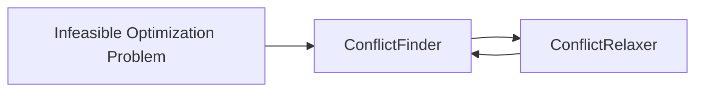
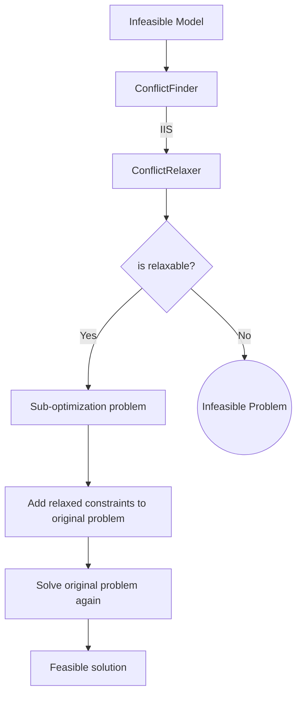

## Introduction to the "Infeaseability Problem"

Optimization problems are often studied in a simplified way, without considering the real-world complexities that businesses and industries face. I recall the first time I learned about this was in a class, when a master’s student presented his thesis on a [rostering problem (NSP)][1] for a transportation firm. He revealed that his optimized solution for the rostering cost (the objective value) was actually worse than the current one. The firm wanted to reduce the number of staff for the shifts, but the model suggested that they needed to hire two more people.

He explained that the reason for this outcome was that the current schedule "relaxed" ~~ignored~~ many constraints (imposed by work regulation laws, union agreements, company policies and staff preferences). By the way, yes, they "discovered" that they were "not complying" when they built the optimization model for rostering (no comments). 

After finishing my degree, I started working on various optimization models in different industries. I soon realized that many optimization problems had constraints that were very “optimistic”. ~~Luckily, none of them were as non-compliant as the rostering problem~~ 😂, but it was still quite common (in my experience) to encounter business problems that were framed in very unrealistic ways. 

1. I want to build a rocket that can reach Mars.
1. It should cost less than $100.
1. It has to be built in 5 months.
1. It has to be made of paper and tape.
 
Yes, that kind of problems. So you quickly learn, after a few "negotiations" with the client that  __not all the constraints have the same "importance"__, some of them can be relaxed some others not, and you have to "tweak" your model to do so. 

## Easy-to-Implement Solutions

On the open source world, you usually have a very limited amount of solvers and among those the most frequent alternative it's to use ["elastic constraints"][2] ([tutorial][3]). Which its one of the easiest solutions. 

Basically what we do its to define a region $D$ where the constraint will be penalty free. 

$$g(x) = c \to g(x) \in D $$

Where $D$ consist usually by lower and upper bound $D=[{d}_{low},{d}_{high}]$, along with a penalty cost `rhs`, `lhs`. The [documentation][1] is not very clear, but based on the [tutorial][3], it seems like this will add a penalization term into the objective function (1), which is manually added into the definition of the elastic constraint  `[l]rhs`.

$$\min f(x) - rsh*\delta_{g} \tag{1}  $$
$$\text{st. }  x \in S$$

Another possible alternative is that this actually solves a sub-optimization problem that minimizes the deviation of the constraint, given that we need the problem to be feasible (2). However, in my practical experience, I found that the results were inconsistent.

$$ \min {\delta_{high}*lhs + \delta_{low}*rhl}  \tag{2}$$
$$\text{st. }  x \in S$$

Where $\delta_{<i>}$ corresponds to the constraint deviation, also known as "slack variable". 

### The Limitations of the above solutions 

These approaches work well for simple infeasibility problems. However, in reality, they usually aren't that simple. I believe there are four reasons why I tend to avoid this type of relaxation:

1. It typically requires a manually fixed cost value, which is very tricky to define. This unintentionally changes the optimization problem.
1. The relaxation process either relaxes all the "relaxable" constraints or it doesn't.
1. Depending on the defined punishment cost, it's possible that the optimization model relaxes the constraint when it's not necessary (if the gain in the objective function is good enough), and this is very hard to control.
1. When more than one constraint is relaxed, it's possible that the value of the objective function becomes so disproportionate that the optimal solution makes no sense.

**In summary**, this approach tends to be quite unreliable and complex. That's why ["serious solvers"][5] have implemented their own robust solutions like [cplex feasopt][4].

### Making my own `feastopt`  

Given that I was ~~poor as fuck~~ not able to purchase a CPLEX license,  I decided to create my own infeasibility solver inspired by CPLEX. Let's discuss some of the features of `feastopt`:

1. `feastopt` only relaxes constraints when necessary. The algorithm does not modify the objective function of the original problem by adding punishment costs or any other type of gibberish.
1. `feastopt` does not relax all relaxable constraints when solving an infeasible problem. It only relaxes what is necessary based on a priority order.
1. `feastopt` provides a constraint priority order. This means that when faced with infeasibility, it will only relax the lowest level constraints possible until the problem becomes feasible. However, it will only relax constraints that make the problem infeasible, not all constraints at the same level.
1. Only when two or more constraints of different levels need to be relaxed will an arbitrary cost come into play. However, this should not happen very often.

In a nutshell `feastopt` separates this problem in two algorithms. The "Conflict Finder" and the "Conflict Relaxer". 



Let's discuss the `ConflictFinder` algorithm in more detail.

### The ConflictFinder

The ConflictFinder is an algorithm that searches for sets of constraints that cannot be reduced further, also known as Irreducible Infeasible Sets (IIS). These sets contain a group of constraints that, if any one of them is eliminated, the problem becomes feasible. For example, the set of constraints:

$$x\ge1$$
$$x\le0$$

Is an IIS because it cannot be reduced further. On the other hand, the set of constraints:

$$x\ge1$$
$$x\ge2$$
$$x\le0$$

is an infeasible set but can still be reduced further, so it is not an IIS. There are several basic algorithms that can help solve this problem, and I have implemented a few of them described in the publication by [Olivier Guieu and John W. Chinneck (1998)][6].

I have implemented two algorithms, `DELETION_FILTER` and `ADDITIVE_ALGORITHM`, in this [module][7]. In a nutshell, both algorithms eliminate or add constraints until they reach the IIS (Irreducible Infeasible Sets). 


An example of its use:

```python
import mip
import conflict 

# Create a new model
model = mip.Model()
x = model.add_var(name="x")
y = model.add_var(name="y")
model.add_constr(x + y <= 1)
model.add_const(x + y >= 2)
model.objective = mip.maximize(x + y)

# Solve the model
status = model.optimize()
print(f"Solution status: {status}")

# find the IIS
cf = conflict.ConflictFinder(my_infeasible_model)
iis = cf.find_iis(method=conflict.IISFinderAlgorithm.DELETION_FILTER) 
print(iis)
```

Now, having a way to find an IIS we are one step to make our own `feasopt`

### The Conflict Relaxer

Inspired on `feasopt` I added into the [python-mip library][8] into the constraint class `mip.Constr` a `priority` attribute. This attribute its just a `Enum` that will tell me if the constraint has one of the following [ConstraintPriorities][9]

```python
    # constraints levels
    VERY_LOW_PRIORITY = 1
    LOW_PRIORITY = 2
    NORMAL_PRIORITY = 3
    MID_PRIORITY = 4
    HIGH_PRIORITY = 5
    VERY_HIGH_PRIORITY = 6
    MANDATORY = 7
```

we developed a first version of the relaxation algorithm [`hierarchy_relaxer`][10] that will consist basically in iteratively search for IIS, to then, solve a sub-optimization problem that relax the constraints on the minimum amount possible until the IIS its feasible, Then we include the relaxed constraints (constraints + slack values) on the original problem and solve again. 





[1]:<https://en.wikipedia.org/wiki/Nurse_scheduling_problem>
[2]:<https://coin-or.github.io/pulp/guides/how_to_elastic_constraints.html>
[3]: <https://medium.com/walmartglobaltech/fine-tuning-optimization-results-with-scenario-planning-using-elastic-constraints-1c3129272349>
[4]: <https://www.ibm.com/docs/en/doc/3.9.1.0?topic=algorithm-feasopt>
[5]: <https://www.ibm.com/products/ilog-cplex-optimization-studio>
[6]: <https://www.sce.carleton.ca/faculty/chinneck/docs/GuieuChinneck.pdf>
[7]: <https://github.com/pabloazurduy/python-mip-infeasibility/blob/7c2d239a609951cc5095a3c63657d8b76b1aec80/conflict.py#L19>
[8]: <https://python-mip.readthedocs.io/en/latest/classes.html#mip.Constr>
[9]: <https://github.com/coin-or/python-mip/blob/0b47e616aeb4520443bbff7e687bc6786edec511/mip/constants.py#L172>
[10]: <https://github.com/pabloazurduy/python-mip-infeasibility/blob/master/conflict.py#L206>