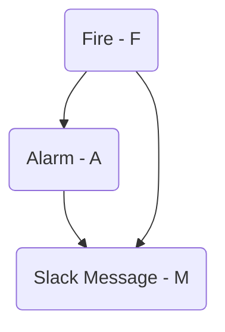

## A made up story (-not based on real events-)

Imagine that you work in an office where the fire alarm starts ringing from time to time without any apparent reason. Maybe it's because there's a construction site nearby that triggers the smoke detectors, or maybe the system isn't working properly.

To address the issue of false alarms, the office administration implements a second validation process that sends a message via an internal Slack channel to confirm whether the alarm is real or not. However, this process still has a probability of sending false alarms. After several false alarms and pointless evacuations, you start to wonder: [what's the probability that there's a real fire in the building?](#calculator) 

Introducing: [Bayesian Networks][1]

_I don't care, take me to the [calculator](#calculator)_

## Bayesian Networks

As someone who, like me, enjoys Bayesian probability, you can transform this problem into a set of random variables and certain relationships between them. We will make use of a well-known structure called ["Bayesian networks"][2] that will allow us to first fit certain data to determine the underlying probabilities, and secondly, to use the network to answer questions such as, "If the alarm starts ringing and there's no Slack message, [what is the probability of a fire in the building?](#calculator)"

To estimate the probability of a real fire in the building, we will define three binary random variables: Fire ($F$), Alarm ($A$), and Slack Message ($M$). We will define their relationships using the following graph (also known as [DAG][3]) 



Each variable has a binary status $X \in [0,1]$. In the case of $F=1$, it represents fire, while $F=0$ represents no fire. Similarly, $A=1$ represents the event of the alarm being triggered, and $A=0$ otherwise. Finally, $M=1$ represents the status of the administrator confirming the alarm, and $M=0$ otherwise.

Each variable conditional probability can be added into a table. In this case as an example **I will fill the probabilities with a value just to make the example clearer**.

Fire $F$ probabilities (just using this numbers as an example) 

| $F$        | Probability |
|------------|------------:|
| 0          |   0.99      |
| 1          |   0.01      |

In the upper table, we can see that the probability of fire is 0.01 and the probability of non-fire its 0.99. We can also notice that this table is not conditional on any other variables; fire is an **independent node**. However, we will see that this changes in the case of $A$, where $A$ probability depends on the fire status. 

You can see the Alarm ($A$) conditional probabilities in the following table. (again made up values):

| $F$        | $P(A=1\|F)$ | $P(A=0\|F)$|
|------------|-----------:|------------:|
| 0          |   0.2      |   0.8       |
| 1          |   0.99     |   0.01      |

In the Alarm probability table, we can see that the probability of the alarm sounding given that there is a fire is $P(A=1\|F=1)=0.99$, and the probability of the alarm not detecting a fire is:

$$P(A=0|F=1)=1-P(A=1|F=1)=0.01$$

As you can see, the last column is just the complement of the middle one, so it can theoretically be omitted.

The Slack Message node $M$ has conditional probabilities that depend on both $A$ and $F$ (this are again made up values). For example, we can observe from the table that the probability of a Slack Message being sent when the alarm is not raised is zero $P(M=1\|A=0, F=0)=0$

| F          | A          | $P(M=1\|F,A)$| $P(M=0\|F,A)$  |
|:----------:|----------:|-------------:|--------------:|
|    0       |    0       |     0         |   1            |
|    0       |    1       |     0.8       |   0.2          |
|    1       |    0       |     0.5       |   0.5          |
|    1       |    1       |     1         |   0            |

These tables are known as [CPD][4] tables (conditional probability distribution tables). Usually in life, we don't know these tables. Knowing the actual probabilities would make our estimation just a simple multiplication between conditions. but life its hard, so we will need to **infer** them.

Let's assume that our observed dataset $D$ its just a list of events like:


| F | A | M |
|---|---|---|
| 1 | 0 | 1 |
| 0 | 1 | 0 |
| 1 | 1 | 1 |
| 0 | 0 | 0 |
| 1 | 0 | 0 |
| .. | .. | .. |

Each row corresponds to a historical event. Using these values, we would like to infer what the actual [CPD][4] tables look like.

### Making Inference 

As we mention before, we would like to know how our network look like and their probabilities given a dataset $D$. to do that we will make use of [`bnlearn`][5] a python library that help us to do [inference on Bayesian Networks][6]. 

```python
import bnlearn as bn
import pandas as pd

# Create simulated  dataset

D = pd.DataFrame( [(1, 1, 1)] * 1 +   # True  Alarms 
                  [(0, 1, 1)] * 10 +  # False Alarms 
                  [(0, 1, 0)] * 3,    # Dismissed False Alarm
                  columns=['F', 'A', 'M'])

# Print the dataset
print(D)

# Define the DAG structure
DAG = bn.make_DAG([('F', 'A'), 
                   ('F', 'M'), 
                   ('A', 'M')])
bn.plot(DAG) # plot the dag

# Fit the network to the dataset
DAG = bn.parameter_learning.fit(DAG, D, methodtype='maximumlikelihood')

# Print the results
CPDs = bn.print_CPD(DAG)
```

This will output 

```python
CPD of F:
+------+-----------+
| F(0) | 0.928571  |
+------+-----------+
| F(1) | 0.0714286 |
+------+-----------+

CPD of A:
+----+-----+-----+-----+
|    |   A |   F |   p |
+====+=====+=====+=====+
|  0 |   1 |   0 |   1 |
+----+-----+-----+-----+
|  1 |   1 |   1 |   1 |
+----+-----+-----+-----+

CPD of M:
+----+-----+-----+-----+----------+
|    |   M |   A |   F |        p |
+====+=====+=====+=====+==========+
|  0 |   0 |   1 |   0 | 0.493177 |
+----+-----+-----+-----+----------+
|  1 |   0 |   1 |   1 | 0.499002 |
+----+-----+-----+-----+----------+
|  2 |   1 |   1 |   0 | 0.506823 |
+----+-----+-----+-----+----------+
|  3 |   1 |   1 |   1 | 0.500998 |
+----+-----+-----+-----+----------+
```
given that we have fit the network we could query: "given that the alarm its ringing and we received an slack message, is there fire? ", or in other words: 

$$P(F =1| M=1, A=1)$$

```python 
q1 = bn.inference.fit(DAG, variables=['F'], evidence={'A':1, 'M':1})
print(q1)
```

This will output:

```python
+------+----------+
| F    |   phi(F) |
+======+==========+
| F(0) |   0.9091 |
+------+----------+
| F(1) |   0.0909 |
+------+----------+
```
### Should I Evacuate ? {#calculator}


> Warning: This calculation is for educational purposes only. Do not rely on it during an emergency. If the alarm starts ringing, evacuate.
{: .prompt-warning }

Just for the sake of fun, I created a simulated dataset varying one of three possible events (I disregarded other types of events to reduce the number of combinations):

1. **True Alarm** $(A,M,F) = (1,1,1)$. There is a fire, the alarm sounds and the message was sent.
2. **False Alarm** $(A,M,F) =(1,1,0)$. The alarm went on, the message was sent, but there's no fire.
3. **Dismissed Alarm** $(A,M,F) = (1,0,0)$. The alarm went on, but it was disregarded via slack, and there's no fire.

You can use the following calculator to estimate the probability of fire given that there's a slack message and the alarm is ringing, i.e., $P(F =1\| M=1, A=1)$. Simply input the values and the calculator will do the rest.




### The cost of the false alarms

For the sake of this example, let's imagine that the people in the office update their priors based on the Bayesian model that we proposed. This means that eventually, their posterior probability estimations about a real emergency will be very low. In other words, they would not believe sh*t. Let's plot how the fire probability will look like with, and a varying number of false alarms.



<script src="https://cdn.plot.ly/plotly-latest.min.js"></script>
<script src="/assets/js/2023-10-30/calculator.js"></script>
<div id="plot"></div>

Depending on how much people value their lives, we may see more or fewer people ignoring the alarm, which can or can't be concerning, for multiples reasons.

## Conclusion

If the alarm starts ringing, evacuate. It's also important to fix any broken alarms, as this helps people trust the system and evacuate accordingly. 


[1]: <https://algorithmsbook.com/files/dm.pdf#page=54>
[2]: <https://www.youtube.com/watch?v=A6Ud6oUCRak>
[3]: <https://en.wikipedia.org/wiki/Directed_acyclic_graph>
[4]: <https://erdogant.github.io/bnlearn/pages/html/Parameter%20learning.html#examples-parameter-learning>
[5]: <https://erdogant.github.io/bnlearn/pages/html/index.html>
[6]: <https://erdogant.github.io/bnlearn/pages/html/Examples.html#create-a-bayesian-network-learn-its-parameters-from-data-and-perform-the-inference>