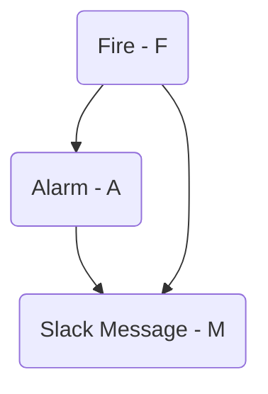

## A made up story ~~(not based on real events)~~

Imagine that in your office the fire alarm goes off frequently without any apparent reason. Maybe it's because there's a construction site nearby that triggers the smoke detectors ~~or maybe the system isn't working properly~~.

To address the issue, the administration implements a second validation system, consisting on sending a message via an internal Slack channel to confirm whether the alarm is real or not. However, this process still confirm several false alarms and after a lot of pointless evacuations, you start to wonder: If the fire alarm goes off, what is the actual probability of a fire in the building?

To answer this question, lets talk about [Bayesian Networks][1]

_I don't care, take me to the [calculator](#calculator)_

## Bayesian Networks

I enjoy using [Bayesian Probability][2] in my day to day, it has a very intuitive way to model and solve problems. The bayesian networks are a graphical way to correlate causal variables in ways that everyone can understand. Let's use this example to illustrate the use of bayesian networks. 

We have three events, that can describe as variables: Fire ($F$), Alarm ($A$), and Slack Message ($M$).In the following  graph we can see that a Fire ($F$) can trigger the alarm $A$, and a Slack Message ($M$) can be trigger if there's an alarm ringing and a real Fire $F$. Each arrow can represent a causal effect of one event into another. This graph is also known as [DAG][3]. 



Each variable has a binary status $X \in [0,1]$. In the case of $F=1$, it represents fire. Similarly, $A=1$ represents the event of the alarm being triggered. Finally, $M=1$ represents a message. 

The idea of bayesian networks its to find the probabilities of all the events using past events data and the graph described by our own knowledge of the relationships between the variables. 


Let's assume that our observed dataset $D$ its just a list of events like:


| F | A | M |
|---|---|---|
| 1 | 0 | 1 |
| 0 | 1 | 0 |
| 1 | 1 | 1 |
| 0 | 0 | 0 |
| 1 | 0 | 0 |
| .. | .. | .. |

Each row corresponds to a historical event. Using these values, we would like to infer what the probabilities look like. 

This probabilities are called: Conditional Probabilities Distribution ([CPD][7]). In the case of our example, given that we only have discrete variables, we could see this CDP's on tables. 

For example in the case of Fire probabilities (CPD), what we have is the following table. This values are based on an example dataset:  

| $F$        | Probability |
|------------|------------:|
| 0          |   0.99      |
| 1          |   0.01      |

In this table we can see that, based in our historical data, the probability of a fire event is 1%, while a probability of not having fire, given the registered events, is 99%. 

In the case of the Fire Alarm $A$, the table its a little bit different given that the Alarm will depend on the Fire event, therefore we will see the conditional probabilities given certain value of F:

| $F$        | $P(A=1\|F)$ | $P(A=0\|F)$|
|------------|-----------:|------------:|
| 0          |   0.2      |   0.8       |
| 1          |   0.99     |   0.01      |

In this case we have two scenarios if there's fire or if there's not. we will have probability values on both cases, alarm given that there's fire  $P(A=1\|F=1) = 0.99 $ and the contrary $P(A=1\|F=0) = 0.2$. 


### Making Inference 

As we mention before, we would like to know how our network look like and their probabilities given a dataset $D$. to do that we will make use of [`bnlearn`][5] a python library that help us to do [inference on Bayesian Networks][6]. 

```python
import bnlearn as bn
import pandas as pd

# Create simulated  dataset

D = pd.DataFrame( [(1, 1, 1)] * 1 +   # True  Alarms 
                  [(0, 1, 1)] * 10 +  # False Alarms 
                  [(0, 1, 0)] * 3,    # Dismissed False Alarm
                  columns=['F', 'A', 'M'])

# Print the dataset
print(D)

# Define the DAG structure
DAG = bn.make_DAG([('F', 'A'), 
                   ('F', 'M'), 
                   ('A', 'M')])
bn.plot(DAG) # plot the dag

# Fit the network to the dataset
DAG = bn.parameter_learning.fit(DAG, D, methodtype='maximumlikelihood')

# Print the results
CPDs = bn.print_CPD(DAG)
```

This will output 

```python
CPD of F:
+------+-----------+
| F(0) | 0.928571  |
+------+-----------+
| F(1) | 0.0714286 |
+------+-----------+

CPD of A:
+----+-----+-----+-----+
|    |   A |   F |   p |
+====+=====+=====+=====+
|  0 |   1 |   0 |   1 |
+----+-----+-----+-----+
|  1 |   1 |   1 |   1 |
+----+-----+-----+-----+

CPD of M:
+----+-----+-----+-----+----------+
|    |   M |   A |   F |        p |
+====+=====+=====+=====+==========+
|  0 |   0 |   1 |   0 | 0.493177 |
+----+-----+-----+-----+----------+
|  1 |   0 |   1 |   1 | 0.499002 |
+----+-----+-----+-----+----------+
|  2 |   1 |   1 |   0 | 0.506823 |
+----+-----+-----+-----+----------+
|  3 |   1 |   1 |   1 | 0.500998 |
+----+-----+-----+-----+----------+
```
given that we have fit the network we could query: "given that the alarm its ringing and we received an slack message, is there fire? ", or in other words: 

$$P(F =1| M=1, A=1)$$

```python 
q1 = bn.inference.fit(DAG, variables=['F'], evidence={'A':1, 'M':1})
print(q1)
```

This will output:

```python
+------+----------+
| F    |   phi(F) |
+======+==========+
| F(0) |   0.9091 |
+------+----------+
| F(1) |   0.0909 |
+------+----------+
```
### Should I Evacuate ? {#calculator}


> Warning: This calculation is for educational purposes only. Do not rely on it during an emergency. If the alarm starts ringing, evacuate.
{: .prompt-warning }

Just for the sake of fun, I created a simulated dataset varying one of three possible events (I disregarded other types of events to reduce the number of combinations):

1. **True Alarm** $(A,M,F) = (1,1,1)$. There is a fire, the alarm sounds and the message was sent.
2. **False Alarm** $(A,M,F) =(1,1,0)$. The alarm went on, the message was sent, but there's no fire.
3. **Dismissed Alarm** $(A,M,F) = (1,0,0)$. The alarm went on, but it was disregarded via slack, and there's no fire.

You can use the following calculator to estimate the probability of fire given that there's a slack message and the alarm is ringing, i.e., $P(F =1\| M=1, A=1)$. Simply input the values and the calculator will do the rest.




### The cost of the false alarms

For the sake of this example, let's imagine that the people in the office update their priors based on the Bayesian model that we proposed. This means that eventually, their posterior probability estimations about a real emergency will be very low. In other words, they would not believe sh*t. Let's plot how the fire probability will look like with, and a varying number of false alarms.



<script src="https://cdn.plot.ly/plotly-latest.min.js"></script>
<script src="/assets/js/2023-10-30/calculator.js"></script>
<div id="plot"></div>

Depending on how much people value their lives, we may see more or fewer people ignoring the alarm, which can or can't be concerning, for multiples reasons.

## Conclusion

If the alarm starts ringing, evacuate. It's also important to fix any broken alarms, as this helps people trust the system and evacuate accordingly. 


[1]: <https://algorithmsbook.com/files/dm.pdf#page=54>
[2]: <https://www.youtube.com/watch?v=A6Ud6oUCRak>
[3]: <https://en.wikipedia.org/wiki/Directed_acyclic_graph>
[4]: <https://erdogant.github.io/bnlearn/pages/html/Parameter%20learning.html#examples-parameter-learning>
[5]: <https://erdogant.github.io/bnlearn/pages/html/index.html>
[6]: <https://erdogant.github.io/bnlearn/pages/html/Examples.html#create-a-bayesian-network-learn-its-parameters-from-data-and-perform-the-inference>
[7]: <https://erdogant.github.io/bnlearn/pages/html/Parameter%20learning.html>