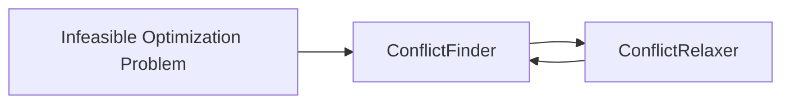
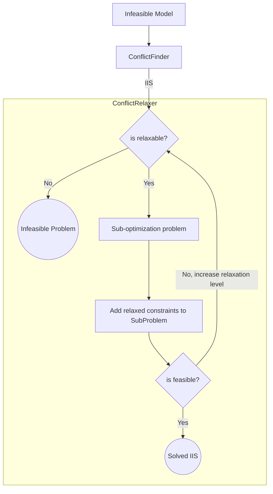

In this post, I will talk about what infeasible optimization problems are and how to solve them. I will finish the post with my own implementation of FeasOpt, the CPLEX algorithm for constraint relaxation.

Let me break down what I'll cover:

1. [What are infeasible optimization problems and why they are so common](#why-infeasible-problems-are-so-common)
2. [Most easy-to-implement solution methods (Elastic Constraints and Penalization Methods)](#the-easy-to-implement-solutions)
3. [The limitations with these methods](#limitations-of-these-methods)
4. [The CPLEX approach and the FeasOpt algorithm](#the-feasopt-algorithm)
5. [Finding Irreducible Infeasible Sets (IIS)](#the-conflictfinder)
6. [My implementation of a hierarchy-based relaxation algorithm](#the-conflict-relaxer)


## Why infeasible problems are so common

While I was studying my master's degree, I attend to a thesis presentation from a student working in an airport operator company. The operator was trying to optimize the worker's shift scheduling. This problem, also known as a [rostering problem][1], is a widely known and challenging problem in Operations Research. But for me, the most interesting part of his presentation was not the modeling itself but the model's final result. 

The company was expecting this model to **reduce the cost**. However, what the student found, is that the operator **needed to hire two more people**, increasing the cost of the previous assignment. The student explained that the origin of this discrepancy was that the problem shift-constraints where usually "relaxed" on the manual solution, but when added into the mathematical model they needed to be fulfilled. 

Some of these constraints were "ok to be relaxed" but some of them not (with legal implications). I don't want to say that "it was funny" that they "found out" that they were breaking the law when building a mathematical optimization model, but it was "interesting" to say the least. From what I'm aware, and according to the speaker, the operator corrected this right away. 

I learned a couple lessons from his presentation; first, don't break the law, and second, mathematical optimization models are not very "flexible" when modeling constraints from "real life". Having said that, "a flexible optimization model" could be very handy (Assuming that you are not relaxing any legal constraints). 

Usually, when you first frame an optimization problem, the "business people" will come with a challenge that looks like this: 

1. We want to build a rocket that can reach Mars.
1. It should cost less than $100.
1. It has to be built in 5 months.
1. It must weight 250 grams. 

{: h='300'}

However, reality will hit you in the form of a: `solver finished, model status: unfeasible`. Yes, mathematical models can't solve unreal expectations. It would be handful not to write the constraints like rules written in stone, but use them as "guidelines" for the problem. Finding "the best possible solution" that breaks the fewer constraints as possible, and just on the amount that is needed.

This is the goal of "relaxation-algorithms", how to relax the constraints the minimum as possible whilst finding a feasible solution. Let's talk about these algorithms.

## The "easy-to-implement" solutions

On the open source world, the solvers usually have an implementation of the ["Elastic Constraints"][2]([tutorial][3]) or ["relaxation via objective function penalization"][12]. 

The Elastic Constraint method, consist on defining a region $D$ where the constraint can be relaxed, penalty free. Usually $D$ is defined by a lower and upper bound $D = [d_{\text{low}},d_{\text{high}}]$ , along with a penalty cost `rhs`, `lhs` in case we move out of the region.

$$ g(x) = c \to g(x) \in D $$

In [PuLP][2], one of the most popular free-LP solvers available, there is implementation of this method. However, in [documentation][2] its not very clear on how this constraint are relaxed, but based on the [tutorial][3], it seems like this will add a penalization term into the objective function $(1)$, which is manually added into the definition of the elastic constraint  `[l]rhs`.

$$\min f(x) - rsh*\delta_{g}^{+} - lhr*\delta_{g}^{-} \tag{1}  $$

$$\text{st. }  x \in S$$

It is not clear if the solver relaxes the constraints on the same optimization problem as $(1)$, or if it solves a sub-optimization problem such as $(2)$  

$$ \min {\delta_{high}*lhs + \delta_{low}*rhl}  \tag{2} $$

$$\text{st. }  x \in S $$

$\delta_{i}$ corresponds to the constraint deviation, also known as "slack variable". 

In my experience, implementing elastic constraints using PuLP, the results were widely inconsistent. My guess is that the implementation is more similar to $(1)$ than to $(2)$, but for reasons that I will explain later, I don't like either of both. 

A second alternative is the ["Penalization Method"][12]. This method is nothing more than a generalization of $(1)$. The idea is to customize the way in which constraint is penalized on the objective function. Additionally, you can normalize these values when dealing with multiple infeasibilities or transform them into non-linear terms (using approximations).  

Both of these methods are simple and can be implemented easily. However, they are very limited and often inconsistent.

### Limitations of these methods 

These methods work well for simple infeasibility problems. However, in my experience, these relaxation methods come with some nuances: 

1. These methods typically require manual fixed costs (EX: `rhs`, `lhs`), which are tricky to define. Also, depending on the values used, it can harm the original optimization problem, this is because changing the objective function can have unexpected consequences. 
1. The relaxation process either relaxes all "relaxable" constraints or not. For feasible problems or those with only "local infeasibilities", the model implementation can become very unreliable.
1. Depending on the defined penalty costs, it is possible that the model relaxes a constraint that doesn't need to be relaxed (if the gain in the objective function is good enough), and this is very hard to control.
1. When more than one constraint is relaxed, it's possible that the value of the objective function becomes so disproportionate that the optimal solution makes no sense.
1. It can be challenging to balance different cost constraints with different magnitudes, especially when prioritizing certain constraints over others. This process can be tedious and manual.

**In summary**, these methods are usually unreliable and complex. That's why ["serious solvers"][5] have implemented more robust solutions like [CPLEX feasopt][4].

### The `feasopt` algorithm

before talking about how `feastopt` works, let's talk about what does it brings:

1. `feasopt` only relaxes constraints when necessary. The algorithm does not modify the objective function of the original problem by adding punishment costs or any other type of gibberish.
1. `feasopt` does not relax all relaxable constraints when solving an infeasible problem. It only relaxes what is necessary based on a priority order.
1. `feasopt` provides a constraint priority order. This means that when faced with infeasibility, it will only relax the lowest level constraints possible until the problem becomes feasible. However, it will only relax constraints that make the problem infeasible, not all constraints at the same level.
1. Only when two or more constraints of different levels need to be relaxed will an arbitrary cost come into play. However, this should not happen very often.

Given all this benefits I decided to create my own version of `feasopt` so, let's talk about how it works. In a nutshell,  `feasopt` separates this problem into two algorithms. The "Conflict Finder" and the "Conflict Relaxer". 



Let's discuss the `ConflictFinder` algorithm in more detail.

### The ConflictFinder

The ConflictFinder is an [algorithm that searches][6] for sets of constraints that cannot be reduced further, also known as [Irreducible Infeasible Sets (IIS)][6]. These sets contain a group of constraints that, if any one of them is eliminated, the problem becomes feasible. For example, the set of constraints:

$$x\ge1$$

$$x\le0$$

Is an IIS because it cannot be reduced further. On the other hand, the set of constraints:

$$x\ge1$$

$$x\ge2$$

$$x\le0$$

Is an infeasible set but can still be reduced further, so it is not an IIS. There are several basic algorithms that can help solve this problem, and I have implemented a few of them described in the publication by [Olivier Guieu and John W. Chinneck (1998)][6].

I have implemented two algorithms, `DELETION_FILTER` and `ADDITIVE_ALGORITHM`, in this [module][7]. In a nutshell, both algorithms eliminate or add constraints until they reach the IIS (Irreducible Infeasible Sets). 

An example of its use:

```python
import mip
import conflict 

# Create a new model
model = mip.Model()
x = model.add_var(name="x")
y = model.add_var(name="y")
model.add_constr(x + y <= 1)
model.add_const(x + y >= 2)
model.objective = mip.maximize(x + y)

# Solve the model
status = model.optimize()
print(f"Solution status: {status}")

# find the IIS
cf = conflict.ConflictFinder(model)
iis = cf.find_iis(method=conflict.IISFinderAlgorithm.DELETION_FILTER) 
print(iis)
```

Now, having a way to find an IIS we are one step to make our own `feasopt`

### The Conflict Relaxer

Inspired by `feasopt` I added into the [python-mip library][8] into the constraint class `mip.Constr` a `priority` attribute. This attribute its just an `Enum` that will tell me if the constraint has one of the following [ConstraintPriorities][9]

```python
# constraints levels
VERY_LOW_PRIORITY = 1
LOW_PRIORITY = 2
NORMAL_PRIORITY = 3
MID_PRIORITY = 4
HIGH_PRIORITY = 5
VERY_HIGH_PRIORITY = 6
MANDATORY = 7
```

We developed a first version of the relaxation algorithm [`hierarchy_relaxer`][10] that will consist basically of iteratively searching for IIS, to then, solve a sub-optimization problem that relaxes the constraints on the minimum amount possible until the IIS is feasible, Then we include the relaxed constraints (constraints + slack values) on the original problem and solve again. 



As you may have noticed, there is a `MANDATORY` level for constraints that should never be relaxed. If the IIS only contains mandatory constraints at the lowest level, the problem will be infeasible. This is the purpose of the `"is relaxable?"` node.

The sub-optimization problem that we will solve involves minimizing the sum of the slack variables, subject to the constraints of the IIS that are at the relaxable level. We always start with the lowest level on the IIS, and if it's not feasible, we increase the levels by one until the IIS is feasible or we reach the mandatory level. In the latter case, we have found an infeasible problem.

$$\min \sum_{i \in IIS}{|S_{i}*C_{lvl}(lvl(i))|} $$

$$\text{st. } g_{i}(x)+ S_{i}  = 0  \quad \forall{i} \in \text{Relaxed Levels}$$

$$g_{i}(x)  = 0  \quad \forall{i} \in \text{Higher Levels}$$

On the objective function of this sub-optimization problem, we add a cost that increases for higher levels. This is how we can handle situations where more than one level is being relaxed simultaneously. The cost is $10^{lvl}$ times higher for level $lvl$. 

The slack value $S_i$ represents the amount by which a given constraint is relaxed. Since each constraint can have different sensitivities ($\le$, $\ge$, $=$), we add a slack variable to relax the bound accordingly.
Finally, the code for this algorithm is available again in the same [`conflict.py`][10] module. 

```python 
cr = conflict.ConflictRelaxer(model=model)
relaxed_model = cr.hierarchy_relaxer(relaxer_objective='min_abs_slack_val')

print(cr.iis_num_iterations)      # number of IIS iterations 
print(cr.iis_iterations)          # list of IIS iterations (constraintLists of each iteration)
print(cr.relax_slack_iterations)  # list of dicts with {crt:slack_value} on each IIS iteration 
print(cr.slack_by_crt)            # summary of all relaxation values (slacks) of all constraints when finished
```

### Some limitations 

There are a few limitations to this algorithm:

1. The sub-problem objective function is the absolute value of the slacks, so it's the same for the problem to relax one or ten constraints that sum up to the same value. `feasopt` has other objective function alternatives, such as $\sum S^2$ or the number of violated constraints, and so on. In this implementation, we only consider the sum of the absolute values.

1. There are scenarios when a set of constraints can be alternated in very inefficient ways, making this algorithm take forever to complete. It's a weird scenario, but I've experienced it. It happens when a large set of constraints needs to be relaxed against a higher-level constraint, and we sub-select them one by one against the other one in an eternal iteration. To fix this, I added a `fast_relaxer` parameter that implements a modified version of this algorithm. When finding an IIS, it will include all the constraints of the lower level in the original problem relax them all at once, and keep going. Yes, I know, it's very non-elegant, but it helps in situations like the one described above.

1. This approach does not solve for the ["Integer Infeasibilities"][6] problem. [The paper][6] provides a detailed explanation of how to identify and address these infeasibilities, but it is a more complex issue to resolve. Adding integer constraints and their relaxations can be a completely different problem. In our approach, we assume that the nature of the variable (i.e., the integer constraints) is mandatory and therefore never relaxed.

## Final thoughts

I learned a lot building this relaxer. I did a pull request on the [python-mip repo][11] to add this [module][10]. However, I have updated it and failed to do the pull request again. Also, I never added this to the package documentation, so I doubt that anyone has used it besides me. This post is the first attempt to document this algorithm. Let's hope that someone reads it. If you are interested and I haven't pushed the pull request on the repository yet, if you find it useful, motivate me to do the PR 😂. Thanks !!!


[1]:<https://en.wikipedia.org/wiki/Nurse_scheduling_problem>
[2]:<https://coin-or.github.io/pulp/guides/how_to_elastic_constraints.html>
[3]: <https://medium.com/walmartglobaltech/fine-tuning-optimization-results-with-scenario-planning-using-elastic-constraints-1c3129272349>
[4]: <https://www.ibm.com/docs/en/doc/3.9.1.0?topic=algorithm-feasopt>
[5]: <https://www.ibm.com/products/ilog-cplex-optimization-studio>
[6]: <https://www.sce.carleton.ca/faculty/chinneck/docs/GuieuChinneck.pdf>
[7]: <https://github.com/pabloazurduy/python-mip-infeasibility/blob/7c2d239a609951cc5095a3c63657d8b76b1aec80/conflict.py#L19>
[8]: <https://python-mip.readthedocs.io/en/latest/classes.html#mip.Constr>
[9]: <https://github.com/coin-or/python-mip/blob/0b47e616aeb4520443bbff7e687bc6786edec511/mip/constants.py#L172>
[10]: <https://github.com/pabloazurduy/python-mip-infeasibility/blob/master/conflict.py#L206>
[11]: <https://github.com/coin-or/python-mip/blob/0b47e616aeb4520443bbff7e687bc6786edec511/mip/conflict.py>
[12]: <https://en.wikipedia.org/wiki/Penalty_method>
