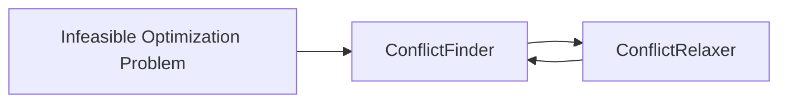
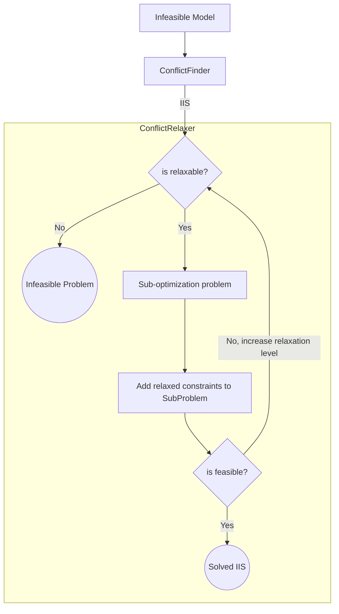

## Introduction to the "Infeaseability Problem"

Optimization problems are frequently studied (in academia) from an 'idealistic' perspective, ignoring how ill-defined they are usually in the industry. I've learned about this gap in presentation from a master's student thesis that solved a [rostering problem (NSP)][1] for a transportation firm, the firm wanted to reduce the cost of staff for the shifts, optimizing the schedules, however, his optimized solution for the rostering problem was **worse** than the "manual solution" already in place, the model suggested that they needed to **hire two more people**.

He explained that the reason behind this was that the current schedule ~~ignored~~ "relaxed"  many constraints (imposed by work regulation laws, union agreements, company policies, and staff preferences).~~yes, they "discovered" that they were "not complying" when they were building the optimization model~~. 

In my personal experience, I've encountered this problem several times, often this is attributed to a “too-optimistic” constraint setting. ~~Luckily, none of them were as non-compliant as the rostering problem~~. Problems are usually defined like this: 

1. I want to build a rocket that can reach Mars.
1. It should cost less than $100.
1. It has to be built in 5 months.
1. It has to be made of paper and tape.

{: h='300'}

Yes, I would like to say it's a joke, but I've faced this problem more that I wish. In consequence, more than few times, optimization problems are ("mathematically") unfeasible 

Then You will find yourself explaining to the stakeholders that "this is not a mathematical problem but an __expectations problem__", and you (usually) end up concluding, with the stakeholder, that __not all constraints hold the same level of "importance"__. Some constraints might be relaxed, some others only if necessary and finally, others cannot be relaxed. 

Now we have another problem on our hands, how can we transfer this constraint importance into our model? or, in other words, is there a way to modify our math model and convert it into a more flexible model? 

Luckily for us, there are a few alternatives that we can implement to solve this problem 

## The "easy-to-implement" solutions

On the open source world, you usually have a very limited amount of solvers and among those the most frequent alternative it's to use ["Elastic Constraints"][2] ([tutorial][3]) or ["relaxation via objective function penalization"][12]. 

On the Elastic Constraint approach what we do is to define a region $D$ where the constraint will be penalty free. Where $D$ usually consist by a lower and upper bound $ D = [ {d}_{low},{d}_{high} ]$, along with a penalty cost `rhs`, `lhs`

$$ g(x) = c \to g(x) \in D $$

The [documentation][1] its not very clear on how this constraint its relaxed, but based on the [tutorial][3], it seems like this will add a penalization term into the objective function $(1)$, which is manually added into the definition of the elastic constraint  `[l]rhs`.

$$\min f(x) - rsh*\delta_{g}^{+} - lhr*\delta_{g}^{-} \tag{1}  $$

$$\text{st. }  x \in S$$

Based on the [documentation][1], it is not clear if the solver relaxes the constraint in a certain way or solves a sub-optimization problem $(2)$ that minimizes the deviation of the constraint. It could be either of these approaches. However, in my practical experience implementing elastic constraints, I found the results to be inconsistent. It appears that the first alternative is the one used.

$$ \min {\delta_{high}*lhs + \delta_{low}*rhl}  \tag{2} $$

$$\text{st. }  x \in S $$

Where $\delta_{i}$ corresponds to the constraint deviation, also known as "slack variable". 

In the ["Penalization Approach"][12] , we essentially follow the process described in equation $(1)$ in a more flexible way. When implementing this approach manually, you have the option to customize the way in which each term is penalized on the objective function. Additionally, you can normalize these values when dealing with multiple infeasibilities or transform them in non-linear ways.  

Both of these approaches are simple and can be implemented easily. However, in my personal experience, they are very limited and often inconsistent. Let me explain the limitations of these approaches in more detail.

### Limitations of these approaches 

These approaches work well for simple infeasibility problems. However, in reality, they usually aren't that simple. I believe there are few reasons why I tend to avoid this type of relaxation:

1. It typically requires a manually fixed cost value, which is very tricky to define. This unintentionally changes the optimization problem.
1. The relaxation process either relaxes all "relaxable" constraints or not. For feasible problems or those with only "local infeasibilities", the model implementation can become tricky.
1. Depending on the defined punishment cost, it's possible that the optimization model relaxes the constraint when it's not necessary (if the gain in the objective function is good enough), and this is very hard to control.
1. When more than one constraint is relaxed, it's possible that the value of the objective function becomes so disproportionate that the optimal solution makes no sense.
1. It can be challenging to balance different cost constraints with different magnitudes, especially when prioritizing certain constraints over others. This process can be tedious and manual.

**In summary**, this approach tends to be quite unreliable and complex. That's why ["serious solvers"][5] have implemented their own robust solutions like [CPLEX feasopt][4].

### Making my own `feasopt`  

Given that I was ~~poor as fuck~~ not able to purchase a CPLEX license,  I decided to create my own infeasibility solver inspired by [`CPLEX feastopt`][4]. Let's discuss some of the features of `feastopt`:

1. `feasopt` only relaxes constraints when necessary. The algorithm does not modify the objective function of the original problem by adding punishment costs or any other type of gibberish.
1. `feasopt` does not relax all relaxable constraints when solving an infeasible problem. It only relaxes what is necessary based on a priority order.
1. `feasopt` provides a constraint priority order. This means that when faced with infeasibility, it will only relax the lowest level constraints possible until the problem becomes feasible. However, it will only relax constraints that make the problem infeasible, not all constraints at the same level.
1. Only when two or more constraints of different levels need to be relaxed will an arbitrary cost come into play. However, this should not happen very often.

In a nutshell `feasopt` separates this problem into two algorithms. The "Conflict Finder" and the "Conflict Relaxer". 



Let's discuss the `ConflictFinder` algorithm in more detail.

### The ConflictFinder

The ConflictFinder is an [algorithm that searches][6] for sets of constraints that cannot be reduced further, also known as [Irreducible Infeasible Sets (IIS)][6]. These sets contain a group of constraints that, if any one of them is eliminated, the problem becomes feasible. For example, the set of constraints:

$$x\ge1$$

$$x\le0$$

Is an IIS because it cannot be reduced further. On the other hand, the set of constraints:

$$x\ge1$$

$$x\ge2$$

$$x\le0$$

is an infeasible set but can still be reduced further, so it is not an IIS. There are several basic algorithms that can help solve this problem, and I have implemented a few of them described in the publication by [Olivier Guieu and John W. Chinneck (1998)][6].

I have implemented two algorithms, `DELETION_FILTER` and `ADDITIVE_ALGORITHM`, in this [module][7]. In a nutshell, both algorithms eliminate or add constraints until they reach the IIS (Irreducible Infeasible Sets). 


An example of its use:

```python
import mip
import conflict 

# Create a new model
model = mip.Model()
x = model.add_var(name="x")
y = model.add_var(name="y")
model.add_constr(x + y <= 1)
model.add_const(x + y >= 2)
model.objective = mip.maximize(x + y)

# Solve the model
status = model.optimize()
print(f"Solution status: {status}")

# find the IIS
cf = conflict.ConflictFinder(model)
iis = cf.find_iis(method=conflict.IISFinderAlgorithm.DELETION_FILTER) 
print(iis)
```

Now, having a way to find an IIS we are one step to make our own `feasopt`

### The Conflict Relaxer

Inspired by `feasopt` I added into the [python-mip library][8] into the constraint class `mip.Constr` a `priority` attribute. This attribute its just an `Enum` that will tell me if the constraint has one of the following [ConstraintPriorities][9]

```python
# constraints levels
VERY_LOW_PRIORITY = 1
LOW_PRIORITY = 2
NORMAL_PRIORITY = 3
MID_PRIORITY = 4
HIGH_PRIORITY = 5
VERY_HIGH_PRIORITY = 6
MANDATORY = 7
```

We developed a first version of the relaxation algorithm [`hierarchy_relaxer`][10] that will consist basically of iteratively searching for IIS, to then, solve a sub-optimization problem that relaxes the constraints on the minimum amount possible until the IIS is feasible, Then we include the relaxed constraints (constraints + slack values) on the original problem and solve again. 



As you may have noticed, there is a `MANDATORY` level for constraints that should never be relaxed. If the IIS only contains mandatory constraints at the lowest level, the problem will be infeasible. This is the purpose of the `"is relaxable?"` node.

The sub-optimization problem that we will solve involves minimizing the sum of the slack variables, subject to the constraints of the IIS that are at the relaxable level. We always start with the lowest level on the IIS, and if it's not feasible, we increase the levels by one until the IIS is feasible or we reach the mandatory level. In the latter case, we have found an infeasible problem.

$$\min \sum_{i \in IIS}{|S_{i}*C_{lvl}(lvl(i))|} $$

$$\text{st. } g_{i}(x)+ S_{i}  = 0  \quad \forall{i} \in \text{Relaxed Levels}$$

$$g_{i}(x)  = 0  \quad \forall{i} \in \text{Higher Levels}$$

On the objective function of this sub-optimization problem, we add a cost that increases for higher levels. This is how we can handle situations where more than one level is being relaxed simultaneously. The cost is $10^{lvl}$ times higher for level $lvl$. 

The slack value $S_i$ represents the amount by which a given constraint is relaxed. Since each constraint can have different sensitivities ($\le$, $\ge$, $=$), we add a slack variable to relax the bound accordingly.
Finally, the code for this algorithm is available again in the same [`conflict.py`][10] module. 

```python 
cr = conflict.ConflictRelaxer(model=model)
relaxed_model = cr.hierarchy_relaxer(relaxer_objective='min_abs_slack_val')

print(cr.iis_num_iterations)      # number of IIS iterations 
print(cr.iis_iterations)          # list of IIS iterations (constraintLists of each iteration)
print(cr.relax_slack_iterations)  # list of dicts with {crt:slack_value} on each IIS iteration 
print(cr.slack_by_crt)            # summary of all relaxation values (slacks) of all constraints when finished
```

### Some limitations 

There are a few limitations to this algorithm:

1. The sub-problem objective function is the absolute value of the slacks, so it's the same for the problem to relax one or ten constraints that sum up to the same value. `feasopt` has other objective function alternatives, such as $\sum S^2$ or the number of violated constraints, and so on. In this implementation, we only consider the sum of the absolute values.

1. There are scenarios when a set of constraints can be alternated in very inefficient ways, making this algorithm take forever to complete. It's a weird scenario, but I've experienced it. It happens when a large set of constraints needs to be relaxed against a higher-level constraint, and we sub-select them one by one against the other one in an eternal iteration. To fix this, I added a `fast_relaxer` parameter that implements a modified version of this algorithm. When finding an IIS, it will include all the constraints of the lower level in the original problem relax them all at once, and keep going. Yes, I know, it's very non-elegant, but it helps in situations like the one described above.

1This approach does not solve for the ["Integer Infeasibilities"][6] problem. [The paper][6] provides a detailed explanation of how to identify and address these infeasibilities, but it is a more complex issue to resolve. Adding integer constraints and their relaxations can be a completely different problem. In our approach, we assume that the nature of the variable (i.e., the integer constraints) is mandatory and therefore never relaxed.

## Final thoughts

I learned a lot building this relaxer. I did a pull request on the [python-mip repo][11] to add this [module][10]. However, I have updated it and failed to do the pull request again. Also, I never added this to the package documentation, so I doubt that anyone has used it besides me. This post is the first attempt to document this algorithm. Let's hope that someone reads it. If you are interested and I haven't pushed the pull request on the repository yet, push me to do it 😂. Thanks!


[1]:<https://en.wikipedia.org/wiki/Nurse_scheduling_problem>
[2]:<https://coin-or.github.io/pulp/guides/how_to_elastic_constraints.html>
[3]: <https://medium.com/walmartglobaltech/fine-tuning-optimization-results-with-scenario-planning-using-elastic-constraints-1c3129272349>
[4]: <https://www.ibm.com/docs/en/doc/3.9.1.0?topic=algorithm-feasopt>
[5]: <https://www.ibm.com/products/ilog-cplex-optimization-studio>
[6]: <https://www.sce.carleton.ca/faculty/chinneck/docs/GuieuChinneck.pdf>
[7]: <https://github.com/pabloazurduy/python-mip-infeasibility/blob/7c2d239a609951cc5095a3c63657d8b76b1aec80/conflict.py#L19>
[8]: <https://python-mip.readthedocs.io/en/latest/classes.html#mip.Constr>
[9]: <https://github.com/coin-or/python-mip/blob/0b47e616aeb4520443bbff7e687bc6786edec511/mip/constants.py#L172>
[10]: <https://github.com/pabloazurduy/python-mip-infeasibility/blob/master/conflict.py#L206>
[11]: <https://github.com/coin-or/python-mip/blob/0b47e616aeb4520443bbff7e687bc6786edec511/mip/conflict.py>
[12]: <https://en.wikipedia.org/wiki/Penalty_method>
